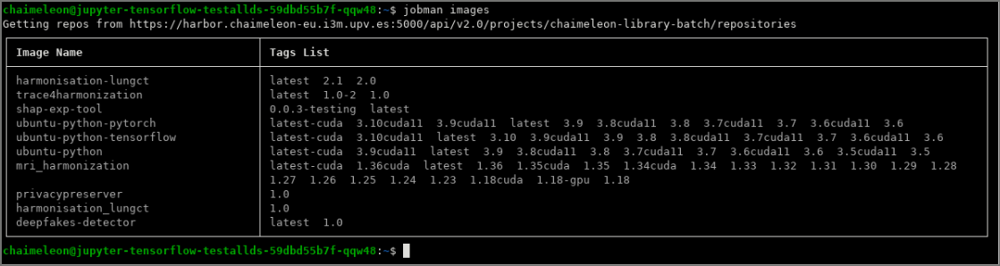
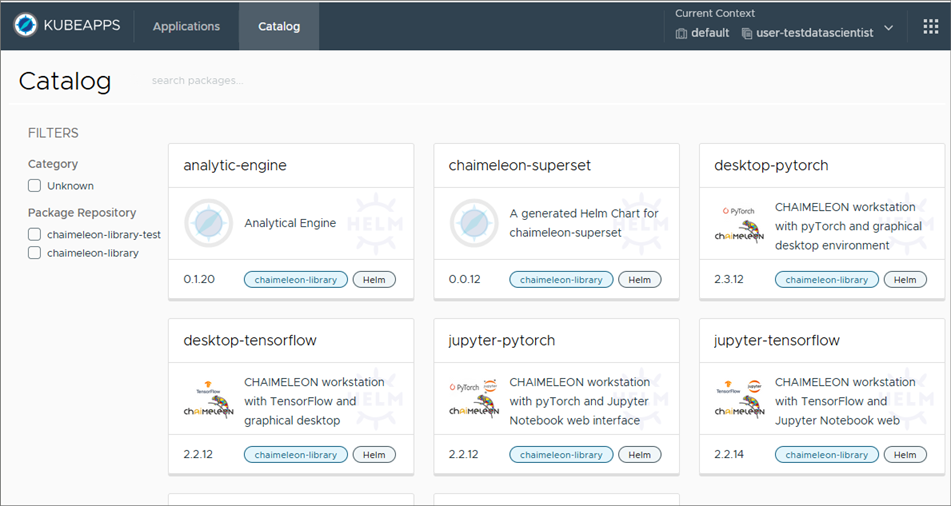

# workstation-images
In this repository you can find the sources to build all the images created by UPV for the CHAIMELEON project.

### Build, test and push
After some change in any of the images, please open the script file (`build.py`) 
and increase the version in the variables defined at the beginning.  
You should also increase the version of the images that are based on the changed image.  
These are the dependencies of images:
```
 - ubuntu-python |-> ubuntu-python-tensorflow --> ubuntu-python-tensorflow-desktop --> ubuntu-python-tensorflow-desktop-jupyter
                 |-> ubuntu-python-pytorch  --> ubuntu-python-pytorch-desktop   --> ubuntu-python-pytorch-desktop-jupyter
```

Then simply run the script:
```
python build.py
```
You will be interactively asked to select which image to build, with or without CUDA, if you want to test, upload, etc.

## Other images in CHAIMELEON platform
Check out the Application Catalogue to see all the images available in the platform:  
https://github.com/chaimeleon-eu/application-catalogue/blob/main/README.md

If you want to take one as an example for the integration of your application, you may want to select one with public dockerfile, 
so you will be able to see all the details and even build by yourself.

## How to integrate your application in CHAIMELEON platform
The normal procedure to integrate an application is creating a docker image containing the main binary or script file and all the dependencies/libraries required to execute it.
But there are some conditions that the image must fulfill, as explained in the [next chapter](#how-to-design-a-workstation-image-for-the-chaimeleon-platform), 
which is a guide for developers to design the image.  

Once you have the dockerfile describing your image, you have to made it available (with all the files needed for building the image) to us in a public or private repository, 
in Github or any other source code repository provider. 
And finally create a request in the [Application Catalogue](https://github.com/chaimeleon-eu/application-catalogue/tree/main?tab=readme-ov-file#request-to-add-or-update-an-application).

We will check the image is according to the guide and then we will build and upload it to the CHAIMELEON image repository.
So the users will see it in: 
 - the list of `jobman images` command, if your application is non-interactive (batch)
   
 - the catalog of applications to deploy, if your application is of type interactive
   
 - obviously also in the [Application Catalogue] (https://github.com/chaimeleon-eu/application-catalogue/blob/main/README.md)

The types of image, the _jobman_ command and the catalog are explained in the next chapters.

**For notifying new images or changes in your image that require to rebuild it**, 
please create a request in the [Application Catalogue](https://github.com/chaimeleon-eu/application-catalogue/tree/main?tab=readme-ov-file#request-to-add-or-update-an-application).
It is recommended to add the label `version` in the dockerfile (see [Labels](#labels)), increment it on every change and include the new version number in the request.

### First of all, check out the usage guide
Before being a developer you should be a user: this way you can understand what is the expected behaviour of any application in the platform.  
So if you have not seen yet the usage guide, it is a good moment:  
https://github.com/chaimeleon-eu/workstation-images/blob/main/usage-guide.md#explore-the-contents-of-a-dataset

### Testing your application in the platform
Before the integration of your application as an image in the platform, you can try to run it just as an application (python script or whatever).  
To do so, just upload the files (script or binary executable and all the dependencies) to your remote desktop and run it directly in the remote desktop
using a dataset from `/home/chaimeleon/datasets/` and writing the results for example in `/home/chaimeleon/persistent-home/my-app-results/`.  
If you don't know yet how to upload and install tools or dependencies see 
[here](https://github.com/chaimeleon-eu/workstation-images/blob/main/usage-guide.md#software-packages-and-dependency-libraries-installation).  
If your application has a lot of dependencies we recommend jumpping to the next chapter to test it directly as an image.  
If you don't know yet how to execute you application or how your application should walk through the dataset contents look at the usage guide (go to the previous chapter).

### Testing your application as an image in the platform
Before the integration of your application as an image in the internal repository of the platform you can try to build it locally in your computer, upload and run it in the remote desktop.  
If you don't know yet how to do that see 
[here](https://github.com/chaimeleon-eu/workstation-images/blob/main/usage-guide.md#running-an-image-with-udocker)

## How to design a workstation image for the CHAIMELEON platform
If you already tested your application as an image in the platform as suggested at the end of the previous chapter, you have done a big part of the work.
With that, you are able to run your own application in the platform as any other user can do with his/her own. 
But in this chapter it is explained **how to adjust your image to be included in the internal repository of the platform**
and so all the users (not only you) can see it and run it (with `jobman submit -i yourApp` in case of non-interactive or using the catalog of interactive applications in that other case).

This is a guide to create a container image for a workstation or batch job to be deployed by other users in the CHAIMELEON platform.  
In this repository you can inspect the dockerfiles used to build all the images created by UPV for the CHAIMELEON project. 
You can take them as examples: 
  - without desktop (i.e. non-interactive, batch applications): ubuntu-python, ubuntu-python-tensorflow or ubuntu-python-pytorch
  - with desktop and browser (i.e. interactive applications, GUI or WebUI): ubuntu-python-xxxxx-desktop or ubuntu-python-xxxxx-desktop-jupyter

If your application requires python and some of the tools included in one of these images, you can take it as the base for your dockerfile, 
putting it in the `FROM` instruction. 

### Template
This is a template for the dockerfile (some details are explained in the next chapters):
```
## Base image:
FROM ...

LABEL name="..."
LABEL version="0.1"
LABEL authorization="..."

############## Things done by the root user ##############
USER root
# Installation of tools and requirements:
RUN apt-get install ...
RUN pip install ...
...

# create the user (and group) "chaimeleon"
RUN groupadd -g 1000 chaimeleon && \
    useradd --create-home --shell /bin/bash --uid 1000 --gid 1000 chaimeleon 
# Default password "chaimeleon" for chaimeleon user. 
RUN echo "chaimeleon:chaimeleon" | chpasswd

############### Now change to normal user ################
USER chaimeleon:chaimeleon

# create the directories where some volumes will be mounted
RUN mkdir -p /home/chaimeleon/datasets && \
    mkdir -p /home/chaimeleon/persistent-home && \
    mkdir -p /home/chaimeleon/persistent-shared-folder
    
# Copy of the application files into the container:
ADD ...

WORKDIR /home/chaimeleon
ENTRYPOINT ["python", "/home/chaimeleon/main.py"]
```

### Labels
If your repository on Github is of type "Private" or it has not a license that allows redistribution (like MIT, GPL, Apache...), 
then we need that you include an authorization as a LABEL in Dockerfile like this: 
```
LABEL authorization="This Dockerfile is intended to build a container image that will be publicly accessible in the CHAIMELEON images repository."
```
Also you should specify the **name** and **version** of the image that will appear in the CHAIMELEON images repository,
you can set the appropiate LABELS. For example:
```
LABEL name="my-cool-tool"
LABEL version="0.1"
```
When the users list the images with `jobman images`, they will see that name and the version as a tag for the image.  
Remember to increment the version if you make any change on the image because the kubernetes default policy to retrieve images is only pull 
if the tag (version) required is not present in the node where the job will run.  
The tag `latest` will also be created pointing to the last version built.  

### There is no Internet access in run time
Things like "apt get", "pip install", "git clone", or any download from a server out of the platform must be in the dockerfile (image build time) not in init scripts (run time). 
Internet access is usually needed to install requirements and tools during the image building. 
Once the image is built and moved to the CHAIMELEON repository, it will be used to create containers running within the platform, with no Internet access, 
and so, 
 - any initial script that tries to download anything from outside will fail, 
 - and any script or application executed by the user which tries to download anything from outside (Internet) will fail.
Aside from this, you can see there is a browser in some of our images. 
Indeed it is needed to access web applications and services running inside the cluster or even locally in the container itself.

### The "chaimeleon" user 
The main process of the container will be run by the user with uid 1000 and gid 1000. 
So you should create it in the OS and use it to create any directory structure (like the directories for later mounting of volumes) 
or copy your application files into the container.  
The name is not important, but we recommend use "chaimeleon" to have an homogeneous environment whatever the type of workstation the user select for his/her work session.

The "root" user is only used in image build time, 
after the `USER  chaimeleon:chaimeleon` instruction all the processes will run with the normal user, including any init script, the shell accessed by SSH, 
the desktop accessed by Guacamole or any web service (Jupyter Notebook, RStudio) for providing a web interface for the user.  
The normal user should not be included into sudoers, the image repository admin will control that 
(only in special cases the user can be added in sudoers for a concrete and safe command, never for any command).

More details and reasons for that in [helm chart guide](https://github.com/chaimeleon-eu/helm-chart-common).

#### Setting the password for "chaimeleon" user
The line with `chpasswd` for setting the password is only needed if it is required that the user can log into the OS (through SSH for example).
You should include that if you want to install sshd and let the user login with this account.
Also you should change it later in an init script by one randomly generated or one set by user in an environment variable. 
In both cases the final password is only known at run time and this is why it must be changed in an init script, for example with:  
``` 
USER=chaimeleon
PREVIOUS_PASSWORD=chaimeleon
PASSWORD=$(< /dev/urandom tr -dc _A-Z-a-z-0-9 | head -c${1:-16};echo;)
echo -e "$PREVIOUS_PASSWORD\n$PASSWORD\n$PASSWORD" | (passwd $USER)
```

For adding an init script you can do this (you should include in the ROOT part, no in the normal user part because `chmod` would fail): 
```
# Add entrypoint script
# (useful if we want to do things with environment variables defined by the user)
ADD run.sh /home/chaimeleon/.init/run.sh
RUN chmod +x /home/chaimeleon/.init/run.sh
ENTRYPOINT ["/home/chaimeleon/.init/run.sh"]
```

### Directories for mounting volumes
Finally some directories should be created in the user home, where the volumes (datasets, persistent-home, persistent-shared-folder) 
will be mounted when the container is created into the platform.
```
RUN mkdir -p /home/chaimeleon/datasets && \
    mkdir -p /home/chaimeleon/persistent-home && \
    mkdir -p /home/chaimeleon/persistent-shared-folder
```
The volumes will be mounted and accessible in the same path in all Desktop containers (the environment from where the user launches jobs via jobman) 
and in all the launched job containers (the environment where the application runs).  

### Entrypoint and typical parameters for batch applications
In case of bath applications it is recommended to add an entrypoint.  
Let's take the example that your application is launched locally with:  
  `python main.py -i <input-dataset-directory-path> -o <results-output-directory>`  
In that example the entrypoint should be like this:  
  `ENTRYPOINT ["python", "/home/chaimeleon/main.py"]`  
That way, the parameters will be specified by the user in the `jobman submit` command after the `--`. 
So, an example of launching the previous application as a job in the platform using jobman could be:  
  `jobman submit -i my-application -- -i ~/datasets/87f3be56-4725-45c3-9baa-d338de530f73/ -o ~/persistent-home/results/`

Take into account also:
 - The dataset directories will be always mounted as read-only and usually the user will put it as the input path, so don't use it to write output or temporal files. 
   You should use `/tmp` to write temporal files.
 - In the dataset directory there is an index file that should be used for walking through the contents of the dataset 
   (see the [usage guide](#user-guide) to know how).
   Our recommendation for your algorithm is that simply accept as an input argument the path of dataset (`/home/chaimeleon/datasets/<dataset-id>`) 
   and use the `index.json` file that will always be in any dataset directory, with that name. 
   The schema is [here](https://github.com/chaimeleon-eu/dataset-service/blob/main/index.schema.json), 
   and [HERE](https://github.com/chaimeleon-eu/workstation-images/tree/main/ubuntu-python/rootfs/home/chaimeleon/application-examples) you can find some simple 
   and useful examples which read this file.

### Environment variables for batch applications
Some applications expect environment variables instead of command parameters.  
In that case, an example of launch of the application as a job in the platform using jobman could be:  
  `jobman submit -i my-application -- -- INPUT_DIR=~/datasets/87f3be56-4725-45c3-9baa-d338de530f73/ OUTPUT_DIR=~/persistent-home/results/`

### Types of images depending on the UI
There are two types of image depending on how the user interact with your application:

 - No interactive, no UI.  
   If your application is launched in batch from the command line, without any interaction required by the user, 
   then it is the easy case, there is **no need to create a helm chart** for adding to the CHAIMELEON's apps catalog. 
   Once the image is built and uploaded to the repository of batch images it will be listed and **usable by jobman**, 
   i.e. the user can submit a job with that image for using your application.
   
 - Interactive, GUI or Web UI.  
   If your app has a user interface intended for the user to interact with, then you need to install a desktop environment, details in the next chapter.  
   If your app has a web user interface, then you need to install a desktop environment and also a web browser 
   to let the user access to your web service running in the same machine ("http://localhost", the remote localhost)[^note].  
   In order to use interactive images, **a helm chart must be created** (see the [helm chart guide](https://github.com/chaimeleon-eu/helm-chart-common)). 
   And once uploaded to the charts repository, a new application will appear in the CHAIMELEON's apps catalog and the user will be able to deploy a remote desktop with that image.
   
[^note]: You can think it is more simple and efficient in resources to put your web service in a platform public endpoint, 
         directly accesible from the user's local desktop browser (so the remote desktop is not needed), 
         but we can't do that due to the project restriction of downloading the medical data. 
         This is only possible in exceptional cases of trusted applications that can ensure the data can't be downloaded by the user.  
         Usually the web apps allow download the data (directly or thru an API if it is of type SPA) so, using a private remote endpoint and a desktop within the platform, 
         the user will be able to download data only to that remote desktop, 
         but not to his/her local desktop, because the remote desktop connection app (Guacamole) is configured to allow upload files but not download
         (indeed it is a web app in a public endpoint, but it is trusted and configurable to only download the video stream of desktop capture and not other files).
   
### (Optional) Include a desktop environment
If your aplication has a graphical UI (or web UI), then you should install:
 - a light desktop environment for the user 
 - a VNC service for let the user access to the remote desktop thru our Guacamole service
 - a SSH service for let the user upload files to the remote desktop thru our Guacamole service
 
You can take the dockerfile in `ubuntu-python-xxxxx-desktop` as an example or as the base for your dockerfile (putting it in the `FROM` instruction of yours).
In this example "lxde" package is installed as a desktop environment (with other uselful tools), "x11vnc" package for the VNC service
and "openssh-server" package for the SSH service.  
It is important also to mention the installation of "supervisor" as a service to start and keep running the rest of services. 
It is required and common in dockerized apps with more than one service.
  
#### Include a browser 
If your application has a web interface then you can install a browser, for example with: ``` apt install firefox ```.
In our example `ubuntu-python-xxxxx-desktop-jupyter` it is included.

Also you may want to add an init script for starting the browser and go to initial web page of your application.
  
### Using GPU resources
If your application can employ GPU resources to accelerate the computation you may want to install the CUDA toolkit 
or just take as the base another image which includes the libraries (using the `FROM` instruction).
For example you can take: "nvidia/cuda:10.2-runtime-ubuntu18.04" or "tensorflow/tensorflow:2.3.1-gpu".

Generally, the images created by UPV for the CHAIMELEON project take the ubuntu official image as the base image, 
and those with a tag which ends in `cuda10` or `cuda11` take the nvidia/cuda official image as the base image.

### Recommendations for reducing the image size
Big-sized image can be problematic (space on disk) and take more time to download from the repository to create the container.  
Besides, the smaller the image, the higher probability to be mantained in cache in the working node, so it don't have to be downloaded again when another user wants to use it.  
You can reduce the size of your container image a lot with a few changes:  
 - Add the parameter `--no-cache-dir` to the installations with _pip_.  
   Example: `RUN pip install --no-cache-dir pydicom`  
   Example: `RUN pip install --no-cache-dir -r requirements.txt`
 - Add the parameter `--no-install-recommends` to the installations with _apt-get_.  
   If, when you put this parameter, some new error appears running your algorithm, 
   the cause of this can be that some required package were installed as a recommendation of another. 
   In that case just add the required package in the list of packages to install, 
   don't rely on your required package will be recommended by the other package.  
   Example: `apt-get -y install --no-install-recommends python3-pip`
 - If you use _poetry_ to install dependencies, remove pip and poetry caches after `poetry install`. 
   It is important to do that in the same `RUN` command. 
   Example: 
   ```
   RUN poetry install \
    && pip cache purge && rm -rf ~/.cache/pypoetry/*
   ```

---

