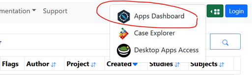
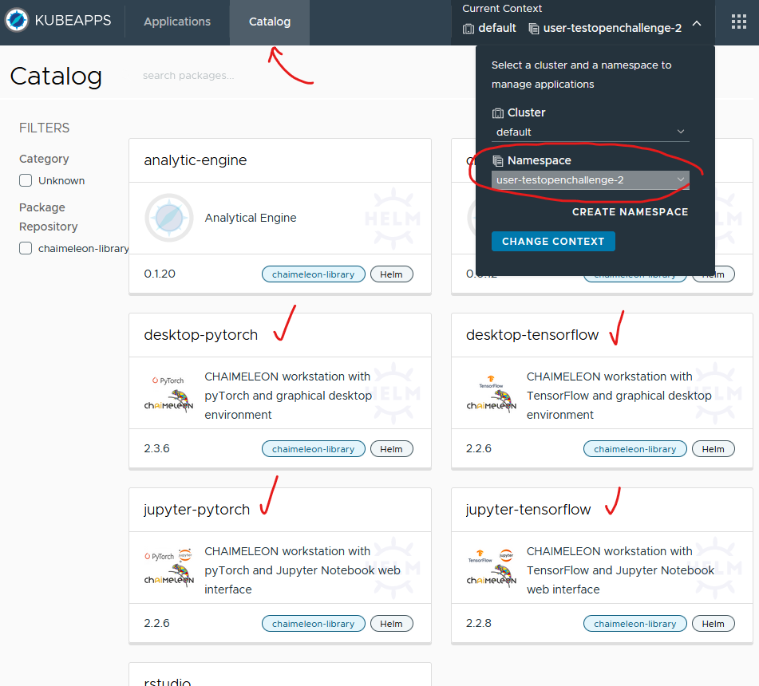
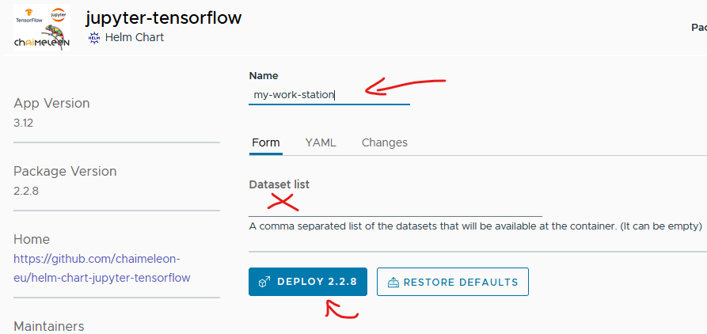
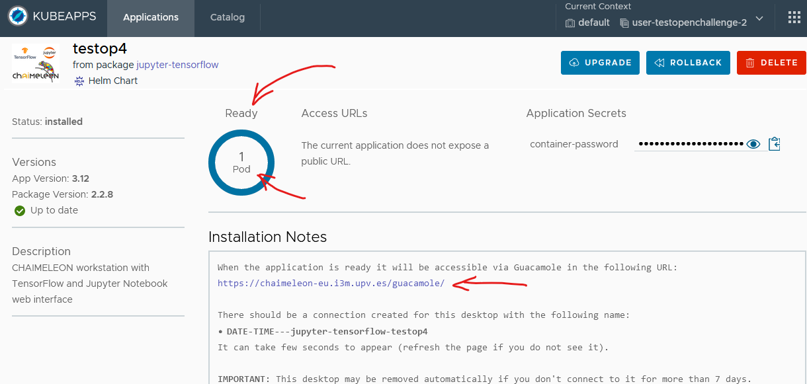

# Workstation Usage Guide
Once a user is registered, s(he) will be able to deploy a desktop using the Apps Dashboard. 
The desktop will be the unique way to access the contents of datasets, AI frameworks and software libraries, 
and to manage (launch, monitor) batch processes (jobs) on the computational resources provided by CHAIMELEON.

## Deployment and deletion of desktops
In [this video](https://drive.google.com/file/d/1KQxLBEtO_iw08JlfNtDZdKgICZJ2RD_N) you can see a short demo of deployment of a desktop.

To deploy a desktop or whatever interactive application you should go to the green buton at the top right side and open the "Apps Dashboard".



In the Apps Dashboard you should ensure your namespace is selected in "Current context" at top right side: it should be `user-<yourUserName>`.



Now you can go to the "Catalog" and deploy a workstation in the CHAIMELEON platform. 
The most common are those that start with "desktop-" and "jupyter-".  
NOTE: if it is your first time, we recommend to select one with "jupyter" 
because you will be able to open the "dataset access guide" notebook directly in the remote desktop to execute the python code step by step
as we will see in the next chapter.

When deploying, just put some name and the id of dataset (or datasets) you are going to work with:



You can leave the "Dataset list" empty if you don't require one today in your work session.  

Alternatively you can search for the dataset you want to access in the initial web page, 
then click on "More" to go to the details, dropdown "Actions" and you will see the item "Use on Apps Dashboard".
This way the "Dataset list" field will be filled automatically.

Finally, after you push the "DEPLOY" button, read carefully the "Installation Notes" and, when the deployment is "Ready" with one or more pods 
(usually it takes few seconds, but depending on demand up to a minute), 
then you can go to the guacamole link and there you will see the connection to your desktop.



You can deploy and delete a desktop in the CHAIMELEON platform as many times as you consider. 
Each deployment using one or more datasets will be logged in the Tracer Service.
But you can have only one active desktop at a time.  
Keep in mind a desktop may be removed automatically if you don't connect to it for more than 7 days.

## Once in the remote desktop
To show/hide the Guacamole menu: CTRL+SHIFT+ALT

You can upload files using this menu or simply drag and drop on the browser window. 
You will find the files uploaded in the home directory (/home/chaimeleon).

The Guacamole menu also allows you to manage the remote clipboard (if you use Chrome you can simply allow the synchronization of the clipboard),
the input method for keyboard and mouse, to adjust the zoom and disconect from the remote desktop.

You can see the complete user manual of this tool here: https://guacamole.apache.org/doc/gug/using-guacamole.html

### Software resources. 
Each desktop has installed the following software:  
  - OS: Ubuntu 22.04 with lxde (graphical desktop environment)  
  - Basic software and libraries: python 3.10, pip, opencv, keras, scipy, scikit-learn, scikit-image, matplotlib, pandas, numpy, pydicom, pillow, dicom2nifti, simpleitk, h5py, nibabel.  
  - AI Frameworks: TensorFlow, PyTorch  
  - Development environment and other tools: JupyterNotebooks, Itk-snap, vim, poetry  
  - Container Engine: uDocker

Other tools/libraries available to install from persistent-shared-folder (see [Special directories](#special-directories)):
  - Development environment: VSCode
  - Python packages: catboost, lifelines, pyradiomics, pywavelets

### There is no Internet access
Things like "apt get", "pip install", "git clone", "wget", "curl" or any access to a web page out of the platform will fail.  
Network connectivity is strongly restricted within the CHAIMELEON platform due to the project general requirement to not allow the medical data to go out.
Applications running in the CHAIMELEON platform do not allow downloading/uploading data from/to external sources (from Internet), 
only there is connectivity to services running within the platform.  
So if you need to install something see the chapter "[Software packages and dependency libraries installation](#software-packages-and-dependency-libraries-installation)".

### Explore the contents of a dataset
There is a dedicated guide of how to access and explore the contents of datasets, 
and it includes the launching and monitoring of a batch process (job) with jobman:  
[dataset access guide](https://github.com/chaimeleon-eu/workstation-images/blob/main/ubuntu-python/rootfs/home/chaimeleon/application-examples/dataset-access-guide.ipynb).

It is in Jupyter Notebook format, Github prints it very well, 
but you can open it directly in the remote desktop to test the dataset access by yourself executing the python code in situ.
Just ensure you deployed a "jupyter" type desktop, open Jupyter Notebook (there is a desktop shortcut), 
go to `application-examples` (in `home` directory) and open `dataset-access-guide.ipynb`.

## Special directories
There are two important directories in the remote desktop and also in jobs (they will be always in the same paths):
  - `/home/chaimeleon/datasets`  
    All the datasets you selected to work with.  
    There is a read-only directory for each and labelled with its Persistent Unique Identifier (PID) in CHAIMELEON.  
    More details of how they are organized in the 
    [dataset access guide](https://github.com/chaimeleon-eu/workstation-images/blob/main/ubuntu-python/rootfs/home/chaimeleon/application-examples/dataset-access-guide.ipynb).
    
  - `/home/chaimeleon/persistent-home`  
    Private persistent storage: for your algorithms, results and whatever you need for the work.  
    If the desktop is deleted and redeployed afterwards, this folder persists and is remounted on the new instance.  
    On the other hand the access to files in it is a bit slower, so you should use the normal home (`/home/chaimeleon`) or `/tmp/` for temporal files if you want your algorithm/workflow go faster.

Other useful directories:
  - `/home/chaimeleon/persistent-shared-folder`  
    Public persistent storage where you can share files with the other CHAIMELEON users
    and you will find other useful resources like documentation, applications, docker images 
    and python packages (from pypi.org which you can install with `pip`, see the "example 4" in `~/persistent-home/init.sh`). 
  
  - `/home/chaimeleon/application-examples`  
    Here you can find some simple application examples including the dataset access guide.

## Software packages and dependency libraries installation
There are two methods to satisfy the dependencies of your training algorithm or to make available in the CHAIMELEON platform any tool you need but not currently available: 
  - You can upload the package and install it as a normal user (not sudo/root).
  - You can build a docker image locally (in your PC), upload the image file and then run it with uDocker.
  
The two options are detailed in the next two chapters.  

### Upload software package and autoinstall
You can [upload](#once-in-the-remote-desktop) your own files (e.g. source code, software packages, dependency libraries, models, etc.) to the desktop. 
That way you can install any package you miss, but only as a normal user (you don't have root privileges in the remote desktop).
If your required software package needs to be installed as root, then use the uDocker method (see the next chapter).

To automate the installation of your tools on every desktop created or job launched, 
you can upload all the installation packages to somewhere in the persistent-home directory 
(for example: `~/persistent-home/my-tools/`) and write down the commands to install them in the script `~/persistent-home/init.sh`.  
You will find a default init.sh file in your persistent-home with some examples to install your own tools/packages.  
That script will be executed automatically at the beginning of the execution of every desktop or job created.

Take into account that, as there is no Internet access, you will need to upload the package you require but also all the dependencies (some of them may be already installed in the platform but some not).

#### Upload and install python packages
Here you can find a practical use case in which the package "lifelines" is installed:  
https://github.com/chaimeleon-eu/workstation-images/blob/main/usage-guide-other/upload-and-install-python-packages.md

#### Upload and install source code python packages
Some python packages are distributed as source code, usually when the extension of file is `.tar.gz` instead of `.whl`.  
In that cases, once downloaded the source code package, pip will compile it to generate the binary files. 
But it can require other dependecies in that step which may not be satisfied in the platform.  
So our recommendations in case of source code packages is to build the wheel with the binaries (the .whl file) locally 
and then upload it to the platform ready to directly install, instead of upload the .tar.gz package and try to install that (which means compile there).

Here you can find a practical use case in which the package "pyradiomics" (distributed as source code) is installed:  
https://github.com/chaimeleon-eu/workstation-images/blob/main/usage-guide-other/upload-and-install-source-code-python-packages.md

### Running an image with uDocker
You can embed your algorithm and all its dependencies in a docker image, upload it to your remote desktop and then run it with uDocker.
Let's see it step by step.

First you must "containerize" (aka "dockerize") your application. 
If you don't know what's that, you can start here: https://docs.docker.com/get-started/
Basically you should write a dockerfile and do `docker build -t myApp:1.0 .` within the directory where the dockerfile is.

We are going to pull an image already built for this example with: `docker pull alpine:3.20` 
So now we have the image in our docker local repository, and we can save it to a file with:
```
docker save alpine:3.20 -o alpine-3.20.tar.gz
```
And then we can upload the tar.gz file to the remote desktop, just drag and drop in the browser window 
and at the end of transfer it will be available in the home directory of the remote desktop. 
You should move to the persistent-home to make it available to all your desktops and jobs.  
In order to use the image, first it has to be loaded, and then you can run it:
```
udocker load -i ~/persistent-home/alpine-3.20.tar.gz alpine
udocker run --rm alpine:3.20 echo hello
```
You probably want to access to the datasets directory and to your persistent home to write results.
In that case you should mount those directories with `-v`:
```
udocker run --rm -v /home/chaimeleon/persistent-home -v /home/chaimeleon/datasets -v /mnt/datalake \
            alpine:3.20 ls -lh /home/chaimeleon/persistent-home
```
Note when the `datasets` directory is mounted, the `datalake` directory must be mounted also in order to provide destination to the symlinks.

At the end, usually you will want to run that in a job (with more resources than the desktop) so this is how you can do that with jobman:
```
jobman submit -- "udocker load -i ~/persistent-home/alpine-3.20.tar.gz alpine \
                  && udocker run --rm -v /home/chaimeleon/persistent-home -v /home/chaimeleon/datasets -v /mnt/datalake \
                             alpine:3.20 ls -lh /home/chaimeleon/persistent-home"
```
For more details of `jobman` command see the chapter [Jobman client tool](#jobman-client-tool).

And if you want to run a job with GPU resources you must add the "-r" argument with the resource flavor you want (for example `small-gpu`) 
and use for the host container one of the images with GPU libraries, i.e. with the tag `latest-cuda`:
```
jobman submit -r small-gpu -i ubuntu-python:latest-cuda -- \
    "udocker load -i ~/persistent-home/nvidia-cuda-11.8.0-runtime-ubuntu22.04.tar.gz nvidia/cuda \
     && udocker run --rm -v /home/chaimeleon/persistent-home -v /home/chaimeleon/datasets -v /mnt/datalake \
     nvidia/cuda:11.8.0-runtime-ubuntu22.04 nvidia-smi"
```
For more details of available resource flavors see the chapter [Resources flavors](#resources-flavors).  
Note for this last example we use a custom image based on the official nvidia/cuda:11.8.0-runtime-ubuntu22.04, 
and just adding the missing apt package "nvidia-utils-525" in order to make available the command `nvidia-smi`.


## Hardware resources
Each desktop has 1 core and 8 GB of RAM. The system can automatically increase to 2 cores if there are available resources.
Those are intentionally small resources to allow more people to create a desktop to connect to the platform. 
The idea is just use it for interactive applications and testing/debuging your algorithms. 
Once you need to launch the execution on the overall dataset (or using a GPU) you should launch a batch job with the "jobman" command (see below).

## Jobman client tool 
CHAIMELEON provides a command line tool named "jobman" specifically designed to manage batch processes (jobs). 
This tool allows the efficient distribution of the computational resources available in CHAIMELEON by launching the workloads as jobs managed by Kubernetes. 
Each desktop has `jobman` available as a command. 
There is a basic example of use at the end of the [dataset access guide](https://github.com/chaimeleon-eu/workstation-images/blob/main/ubuntu-python/rootfs/home/chaimeleon/application-examples/dataset-access-guide.ipynb).

You can always see some usage examples executing the command without arguments:
```
$ jobman
jobman version '1.3.14-BETA'
Checkout jobman source code, releases, and documentation at: https://github.com/chaimeleon-eu/jobman

Usage examples:

      jobman images
      jobman image-details -i ubuntu-python
      jobman submit -i ubuntu-python -j job1 -r no-gpu -- python persistent-home/myScript.py
      jobman list
      jobman logs -j job1
      jobman delete -j job1
      jobman submit -i ubuntu-python:latest-cuda -r small-gpu -- nvidia-smi

Type jobman --help to see a  list of supported commands and more.

```

The first examples are shown in the dataset access guide.  
The last example is to submit a job with the `ubuntu-python` image, using the `latest-cuda` version (important if you want the cuda libraries and tools are included in order to use the GPU) and using the resources flavor (`-r` argument) `small-gpu`.  
All the resources flavors are detailed in the next chapter.

### Resources flavors
Jobman gives access to 21 advanced computational resources that are organized in a queue.  
There are four types of resources and are labeled as `small-gpu`, `medium-gpu`, `large-gpu` and `no-gpu`. 
These are the resources flavors, and the features of each of these are the following*:
 - `small-gpu`  
   This queue provides 8 resources. Thus, it can execute 8 batch jobs concurrently (from different users).  
   Each resource has 4 cores, 32 GB RAM and a GPU Nvidia A30 with 6 GB.  
   In this queue, the time limit for each batch job is 16 hours. If the job is not done within this time, it will be automatically deleted.
 - `medium-gpu`  
   This queue provides 4 resources. Thus, it can execute 4 batch jobs concurrently.  
   Each resource has 8 cores, 64 GB RAM and a GPU Nvidia A30 with 12 GB.  
   In this queue, the time limit for each batch job is 24 hours. If the job is not done within this time, it will be automatically deleted.
 - `large-gpu`  
   This queue provides 5 resources. Thus, it can execute 5 batch jobs concurrently.  
   Each resource has 8 cores, 64 GB RAM and a GPU Nvidia V100 with 32 GB.  
   In this queue, the time limit for each batch job is 24 hours. If the job is not done within this time, it will be automatically deleted.
 - `no-gpu`  
   This queue provides 4 resources. Thus, it can execute 4 batch jobs concurrently.  
   Each resource has 8 cores, 64 GB RAM without GPU.  
   In this queue, the time limit for each batch job is 8 hours. If the job is not done within this time, it will be automatically deleted.
           
\* This are rough numbers, we can change them anytime according to demand.

You can launch batch jobs from your desktop using the Jobman Client tool (jobman) at any time (24x7), taking into account the following points:
 - The queue of Jobman follows a First Input First Output (FIFO) policy by type of resource required.
 - Each user can only have one batch job active (waiting in the queue or running). 
   As an example, if a user launches a job as small-gpu, s(he) won’t be able to launch another one (no-gpu, small-gpu, medium-gpu or large-gpu) until that job ends or (s)he deletes it.
 - If a user launches a type of batch job and all resources of this type are busy, the job will wait for its execution in the queue until the previous launched jobs targeting the same resource type ends. 
   Both waiting and running are considered active batch jobs.  
   As an example, if a user launches a batch job targeting a large-gpu resource, and there are 5 large-gpu jobs running at this moment, 
   the new job will be enqueued and considered active until one large-gpu resource is released.
 - Resources used by jobs launched by jobman are independent of those assigned to the desktops. 
   Thus, a participant can always employ his/her respective desktop for executing processes locally without launching through jobman, even if s(he) already has an active batch job launched with jobman.

